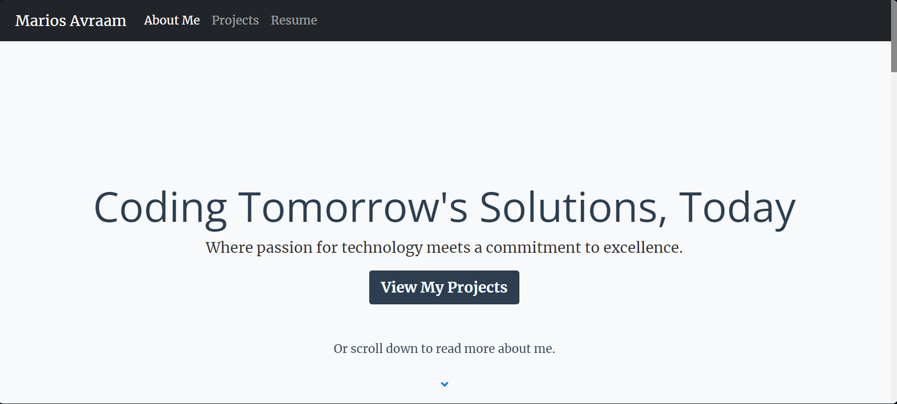

# My Portfolio Website

This repository contains the source code for my personal portfolio website. The site showcases my projects, skills, and provides a way to contact me.

## Features

- Showcase of projects
- Responsive design
- Contact form
- Admin dashboard to manage projects

## Technologies Used

- Flask
- HTML, CSS
- Python

## Deployment

The site is deployed on PythonAnywhere.

## Author
Marios Avraam